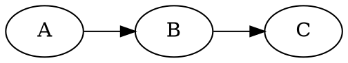

# Bayesian Networks

A method used to represent Joint Distributions implicitly using conditional independence and local interactions.

## Representation

It is represented as a directed acyclic graph. Each variable is a Node, and a directed edge from node `A` to node `B` means that the random variable `B` is a function of random variable `A`. In other words, a random variable is a function of the random variables in its parent nodes.

Every node `A` stores a table that represents the conditional probability of random variable `A` given every combination of values its parents could take.

$$P(A | Parents(A))$$

<figure>
    
    <figcaption> Source: https://inst.eecs.berkeley.edu/~cs188/sp20/assets/lecture/lec-18-handout.pdf </figcaption>
</figure>

## From Conditional to Joint

In order to extract the joint distribution from the local conditionals, we can use the following formula:

$$ P(X_1, X_2, \dots , X_n) = \prod_{i=1}^n P(X_i|Parents(X_i))$$

## Size of a Bayesian Network

In order to store a table that represents an ordinary joint distribution of `N` variables where each variable can take `d` values, one would need $O(d^N)$ entries which is too large.

One important advantage of Bayesian Networks is that they reduce this size needed to store a join distribution by storing different small parts from which we can reconstruct the joint distribution. Every node contains a table that determines its value for every combination of values of its parents. If we assume that every node has no more than `k` parents, this would mean that every node has a table of size $O(d^{k+1})$ ($k + 1$ comes from the fact that we encode the parents and the node itself), so for `N` nodes, we would get a total of $O(Nd^k)$, which is a reduction that depends on `k`, the maximum number of possible parents.

## Does a Bayesian Network Graph imply Causality ?

No, not all the time. It is easier to think of the graph as if it means that a certain variable (parent) is causing another variable (child), but that is not always the case. Rather, it only means that there is a direct conditional dependency between variables.

## How to check for Independence in a Bayesian Networks

If two variables do not have a direct connection, this does **not** mean that they are independent, they might indirectly influence each other through other nodes.

For example in this graph below, `A` and `B` are not necessarily independent because they can influence each other through `B`.

Nevertheless, we can prove **conditional independence**. For example, in the network above, we can say that `C` is conditionally independent from `A` given `B`. The intuition is that since a value of `B` was given, it already holds the influence from `A`, or another way to think of it that the influence between `A` and `C` was blocked by `B`.
