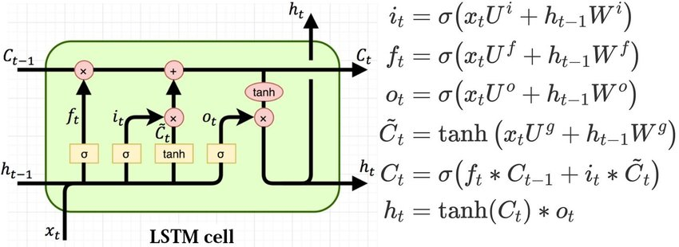

## Code

The code is available on github [here](https://github.com/NazirNayal8/amazon-food-review-text-classification).

## Skills

* Deep Learning
* Neural Networks
* Python
* PyTorch
* Text Processing
* Natural Language Processing

## About

This project was part of the QMBU450 Advanced Data Science with Python course at Koç University.

I used the [Amazon Fine Food Reviews](https://www.kaggle.com/snap/amazon-fine-food-reviews) dataset to train an [LSTM](https://en.wikipedia.org/wiki/Long_short-term_memory) Model to predict the sentiment of the food reviews as a rating that takes an integer value in the range [1,5] (which means have 5 classes).

## Motivation

As a course requirement, we had the freedom to choose any machine learning problem to work on. I chose this particular problem because I was interested in
learning about NLP as I had no prior experience. Spending the semester on learning different concepts and techniques, and then putting them into practice was
so much fun. My interest in NLP grew significantly after this experience.

## What is LSTM ?

A variation [Recurrent Neural Networks (RNNs)](https://en.wikipedia.org/wiki/Recurrent_neural_network) which is capable of learning long-term dependencies of sequenced data (Hence the Abbreviation <u>L</u>ong <u>S</u>hort <u>T</u>erm <u>M</u>emory.

  

## Packages Used

I used the following python packages:

* `cupy`: Used to make numpy operations on gpu.
* `nltk`: Has very useful builtin functions for text processing as well as lists of stop words.
* `spacy`: A high level NLP package with advanced functionalities such is lemmatization, and pre-trained word embeddings.
* `gensim`: Has an implementation for Word2Vec algorithm, which allows for generating a custom set of word vectors for the dataset.
* `torch`: A Deep Learning Framework which supports the LSTM structure.
